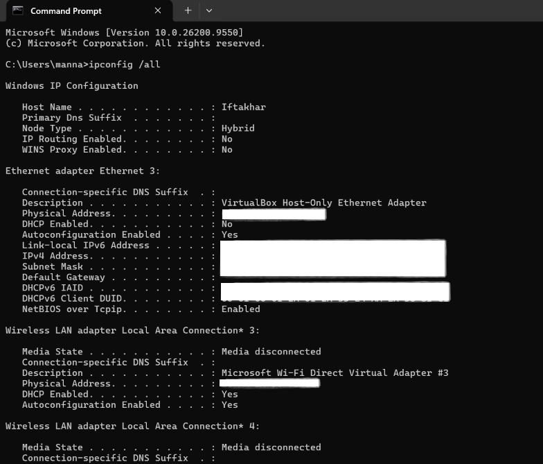
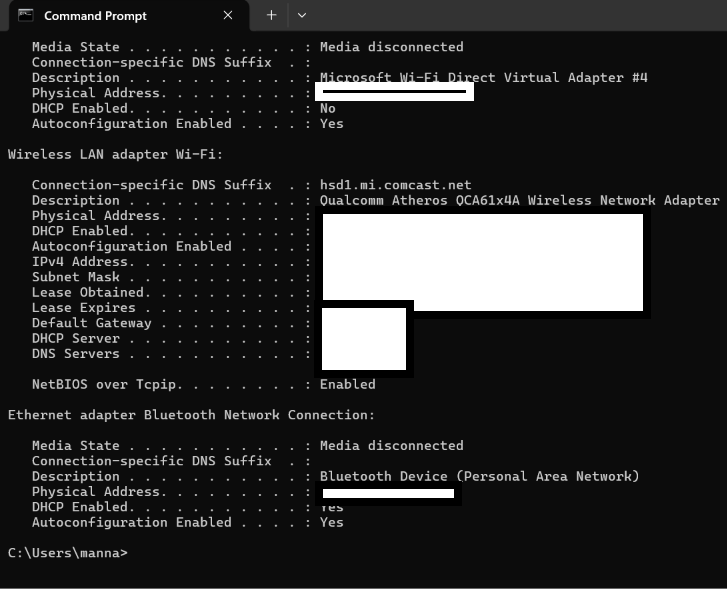
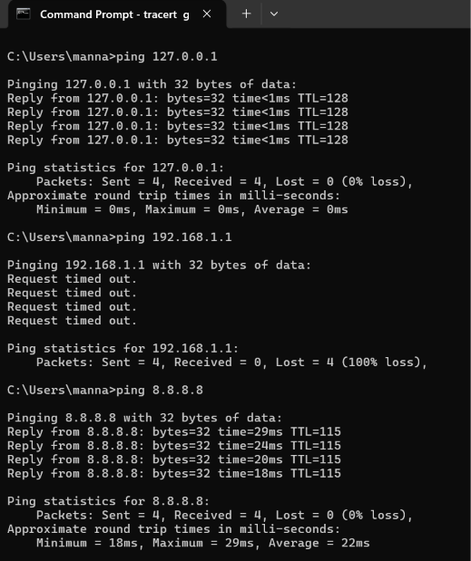
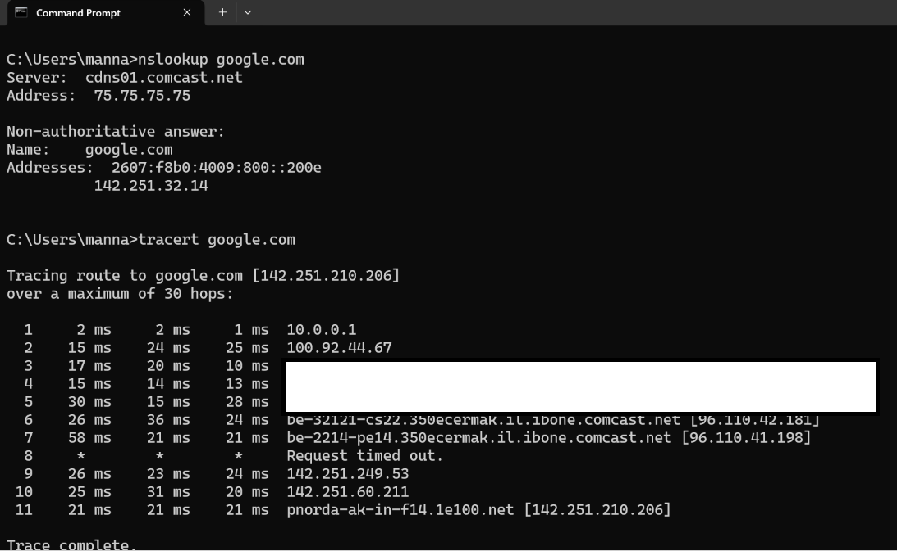

# Networking Case Study: "No Internet Access" Troubleshooting

**Symptom:** User reported being unable to browse the internet, unsure whether the issue was their computer, the network, or something further out.

**Investigation:**
Ran `ping 127.0.0.1` to confirm the local network adapter was functioning correctly. Received successful replies with sub-1ms response times, ruling out any adapter or driver-level issue.

Attempted to ping the assumed default gateway at `192.168.1.1`, which timed out completely (100% packet loss). Rather than concluding the network was down, cross-referenced this against a `tracert` result, which revealed the actual default gateway was `10.0.0.1`, not the assumed address. This confirmed the ping failure was due to an incorrect target, not an actual connectivity problem.

Ran `ping 8.8.8.8` to test raw internet connectivity by IP address, bypassing DNS. Received successful replies with round-trip times between 18 and 29ms, confirming the connection itself was healthy.

Ran `nslookup google.com` to test DNS resolution specifically. Received a valid response, confirming domain name resolution was functioning correctly.

Ran `tracert google.com` to review the full path to an external destination. Traffic passed through the correct local gateway, several ISP-level hops, and reached the destination successfully in 11 hops.

**Root Cause:** No actual network fault was present. Initial gateway ping failure was caused by testing against an incorrect assumed IP address rather than the network's actual default gateway.

**Resolution:** Confirmed the correct default gateway address via `ipconfig` and `tracert`, retested successfully, and validated full end-to-end connectivity and DNS resolution were functioning normally.

**Lesson noted:** Demonstrates the importance of verifying assumptions against actual system output rather than relying on common defaults, since an incorrect assumption can look identical to a real network failure if not cross-checked.

**Screenshots:**

